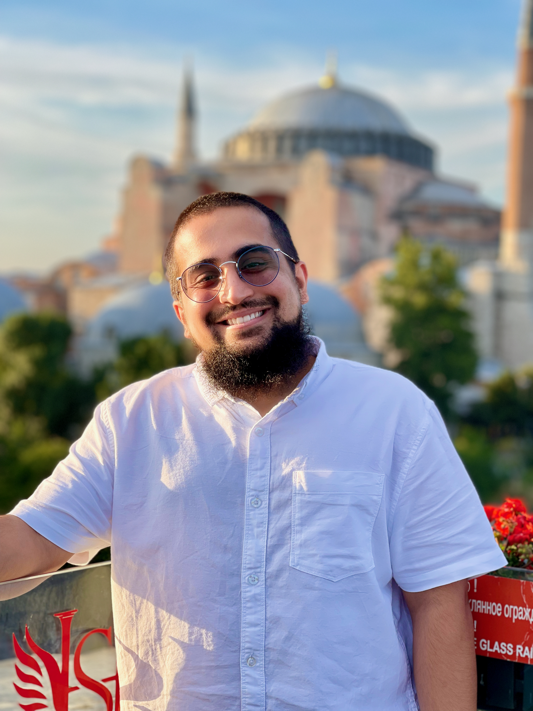

# Get To Know Mustansir




Hi, my name is Mustansir and I would like to tell you about me. First and foremost, I am a husband to Jamila and a father to Adam, 
who was born in June of this year. **Both are my pride and joy**.

## Professional Experience

Along with that, I am a Software Engineer. I interned at *Viasat Inc.* as a Software Engineer Intern in Summer 2021 until December 2021. In January of 2022, I started a position as Full Stack Software Engineer Intern (I know Professor Powell does not believe in Full Stack but it was in the title, haha) at *Wiliot Inc.*, an upcoming Israeli based start up transforming the Internet of Things industry. Finally, in Summer 2022, I interned at *BAE Systems Inc.* as a Software Engineer Intern. 
In September 2022 I started a full-time position as Software Engineer at *SeeByte Inc.*. I am working on software for maritime robots used by the US Navy. I primarily work with the following stack:
```
C++
Python
ROS - Robotics Software
Angular
React.js

```
I am thrilled to get this position before I graduate and I really hope to bring my professional experience into this class.

## About Me

> Do or Do Not, There is No Try - Master Yoda

Firstly, Star Wars is amazing. Secondly, I think this quote by Yoda is one I try to live by. I know it's cliche, but a can-do attitude can go far. I believe all of the successes I have achieved thus far in my life are born of it. 
Along with Star Wars, I love: 
- hiking
- photography
- video games
- traveling

**Fun Fact**: I have visited every continent except Antarctica.
My top three favorite countries:
1. Turkey
2. Greece
3. Nairobi

If you have never been to Turkey, here is a short [YouTube video](https://www.youtube.com/watch?v=2vqvBzb0xJY&ab_channel=JoyousTravel) to give you an intro! 


**TODO This Week**
- [x] Complete Lab 0 & 1 for CSE 110
- [ ] Complete readings for CSE 132A
- [ ] Catch up with Lord of the Rings: The Rings of Power
